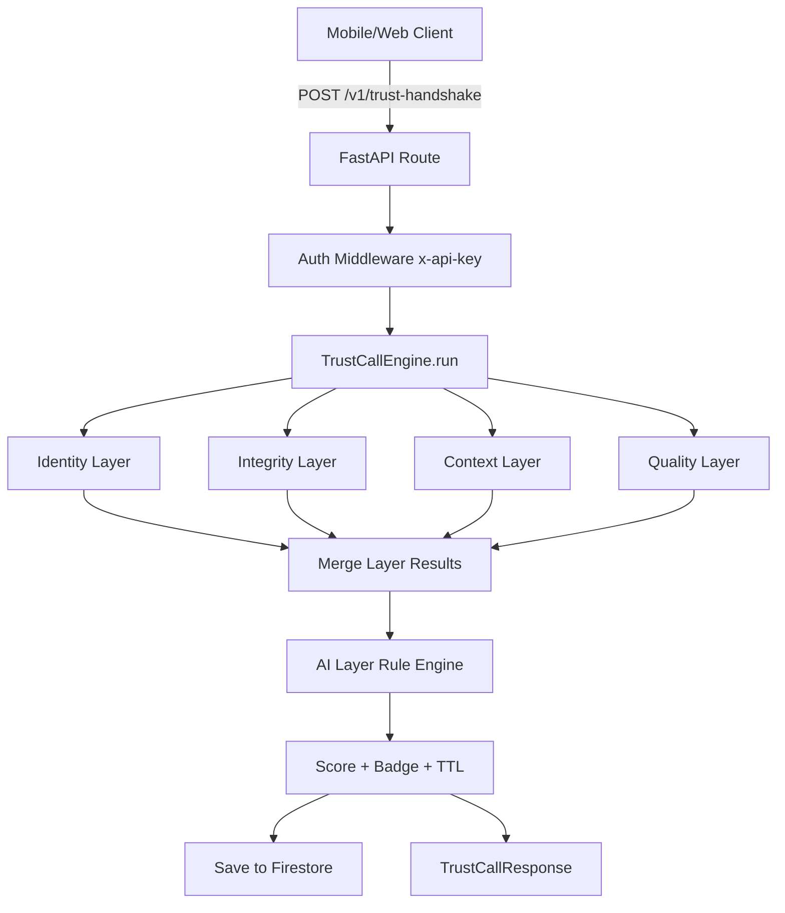
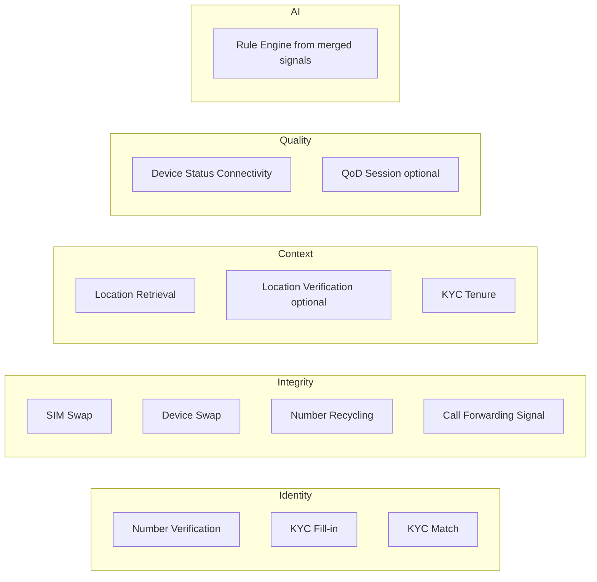
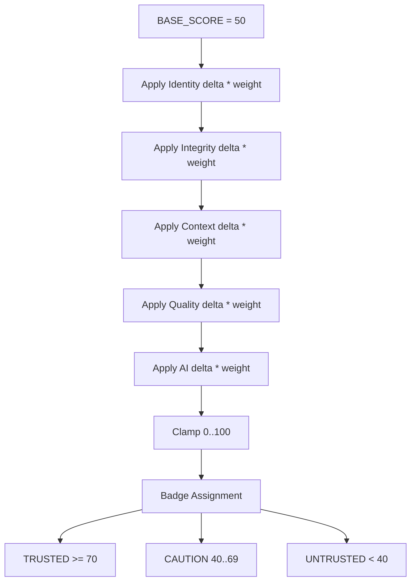

# TrustCall Backend Flow (Layer + API Composition)

This document explains how the `POST /v1/trust-handshake` pipeline works, which Nokia APIs feed each layer, and how the final trust score is composed.

## 1) End-to-End Request Flow

Notes:
- Layers run in parallel via async orchestration.
- Partial API failures are handled gracefully (layer returns result with error field instead of crashing request).
- Firestore persists handshake results for retrieval by request ID.

## 2) Layer → API Mapping

### Current RapidAPI endpoint set in use

- Number Verification
  - `POST /passthrough/camara/v1/number-verification/number-verification/v0/verify`
  - Requires consent auth (`Bearer token` or `code/state`)
- SIM Swap
  - `POST /passthrough/camara/v1/sim-swap/sim-swap/v0/check`
- Device Swap
  - `POST /passthrough/camara/v1/device-swap/device-swap/v1/check`
- Number Recycling
  - `POST /passthrough/camara/v1/number-recycling/number-recycling/v0.2/check`
- Call Forwarding Signal
  - `POST /passthrough/camara/v1/call-forwarding-signal/call-forwarding-signal/v0.3/unconditional-call-forwardings`
- Device Status
  - `POST /device-status/v0/connectivity`
- Location Retrieval
  - `POST /location-retrieval/v0/retrieve`
- KYC Tenure
  - `POST /passthrough/camara/v1/kyc-tenure/kyc-tenure/v0.1/check-tenure`

## 3) Scoring Composition

Use-case weights are applied per layer (`generic`, `banking`, `enterprise`, `emergency`).

## 4) Layer Delta Logic (high-level)

- Identity:
  - positive if number verified / strong KYC match
  - neutralized to `0` when Number Verification or KYC match is unavailable
- Integrity:
  - heavy negative penalties for risk flags (`sim_swapped`, `device_swapped`, `number_recycled`, `call_forwarding_active`)
- Context:
  - positive for validated location / strong tenure
  - tenure contribution neutralized when tenure API is unavailable/mismatch
- Quality:
  - small positive for `CONNECTED_DATA`, negative for `NOT_CONNECTED`
- AI:
  - rule-based confidence adjustment from aggregate red/green flags

## 5) Response Shape (what is composed)

Final response includes:
- `badge`
- `composite_score`
- `layer_results` (each with `score_delta`, `signals`, `apis_called`, `latency_ms`, `error`)
- `confidence`
- `ttl_seconds`

This is the full trust composition output returned to client apps.
